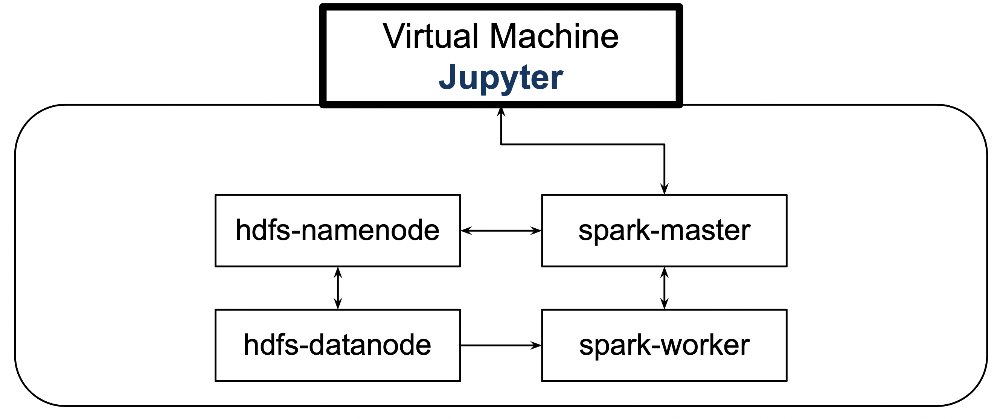
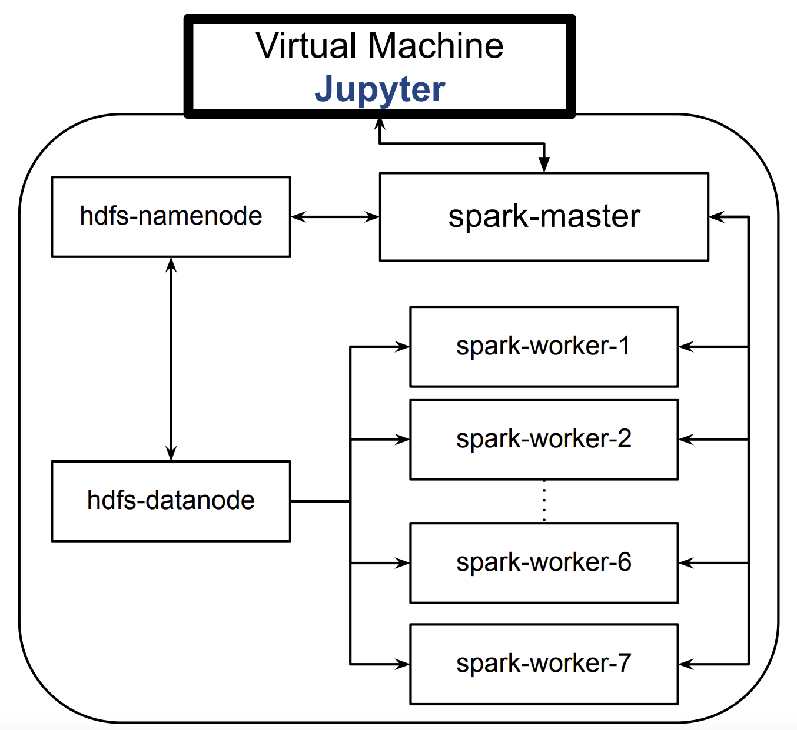

# REDDIT EXPLORE PROJECT
In this project we have used comments from reddit to play around with multiple functionalities of Apache Spark, HDFS and Docker. The main objective of the project was to get our hands dirty with setting up containerized clusters of Apache Spark, HDFS using Docker functionalities. This was done as a part of a grading requirement for Data Engineering I course conducted at Uppsala University.

The collaborators of this project are:

* [Atefeh Aramian](https://github.com/atefeharemian "Atefeh Aramian")
* [Gabriel Arteaga](https://github.com/Gabriel-Arteaga "Gabriel Arteaga")
* [Dinindu Seneviratne](https://github.com/dininduviduneth "Dinindu Seneviratne")
* [Kim Mathews](https://github.com/kimkmathews "Kim Mathews")
* [Tayyab Hasan](https://github.com/TayyabHasan "Tayyab Hasan")
* [Ludvig Westerholm](https://github.com/neddul "Ludvig Westerholm")

The main phases of the project were as follows:

1. Setup a multi-container Spark-HDFS cluster using `docker-compose`.
2. Run multiple analysis on the dataset provided - [Reddit Comments](https://files.pushshift.io/reddit/comments/ "Reddict comments").
3. Choose few analysis pipelines and run experiments to find out the performance with variable worker nodes.

## 1. Setting up the multi-container Spark-HDFS cluster

The base architecture we setup looks as follows:



### STEP 1: INSTALLATION OF PRE-REQUISITES FOR THE VM

* Install pip, Jupyter and PySpark

    ```
    sudo apt install python3-pip
    pip3 install Jupyter
    pip install pyspark
    ```

* Spark Installation

    Download the tarball for Spark 3.2.3
    ```
    wget https://dlcdn.apache.org/spark/spark-3.2.3/spark-3.2.3-bin-hadoop3.2.tgz
    ```
    Extract the tarball
    ```
    tar -xvf spark-3.2.3-bin-hadoop3.2.tgz
    ```
    Remove the zipped file
    ```
    rm spark-3.2.3-bin-hadoop3.2.tgz
    ```
    Move the directory `/opt/` and rename it as `spark`
    ```
    sudo mv spark-3.2.3-bin-hadoop3.2/ /opt/spark
    ```
    Save SPARK_HOME in Environment Variables (.bashrc)
    ```
    nano .bashrc
    ```
    Add the following to the `.bashrc` file
    ```
    export SPARK_HOME=/opt/spark
    export PATH=$PATH:$SPARK_HOME/bin:$SPARK_HOME/sbin
    ```

* Install Docker using official documentation: [Docker Installation](https://docs.docker.com/engine/install/ubuntu/ "Docker Installation")

### STEP 2: SETUP THE PROJECT REPOSITORY

* Clone the reddit-explore-uu repository

    ```
    git clone https://github.com/dininduviduneth/reddit-explore-uu.git
    ```

### STEP 3: BUILD DOCKER IMAGES AND START CLUSTER

* Build and start the base cluster

    ```
    docker-compose up -d
    ```
* Verify successful completion
    
    Check if the required images are created
    ```
    docker images
    ```
    The images `bde2020/hadoop-namenode `, `bde2020/hadoop-datanode`, `docker-config_spark-master` and `docker-config_spark-worker` must have been created.

    Check if the containers are up and running
    ```
    docker ps
    ```
    There should be three containers running - one each for `spark-master`, `spark-worker`, `hadoop namenode` and `hadoop datanode`.

### STEP 4: UPLOADING DATA TO HDFS

* Download the required Reddit dataset to the VM
    ```
    wget https://files.pushshift.io/reddit/comments/[REDDIT_DATASET_FILENAME].zst
    ```
* Extract the dataset
    ```
    unzstd --ultra --memory=2048MB -d [REDDIT_DATASET_FILENAME].zst
    ```
* Delete the zipped file
    ```
    rm [REDDIT_DATASET_FILENAME].zst
    ```
* Push the file to HDFS using `-put` command
    ```
    hdfs dfs -put [REDDIT_DATASET_FILENAME] /
    ```
* Once uploaded the dataset should be visible at the Web UI of HDFS - `http://[PUBLIC IP OF VM]:9870/`

### STEP 5: STARTING JUPYTER AND RUNNING ANALYSIS CODE

* Start a Jupyter server
```
python3 -m notebook --ip=* --no-browser
```

* Navigate to `data-analysis` within the `reddit-explore-uu` directory and run the analysis notebooks.

### STEP 6: SCALING

We have used Docker's `docker-compose scale` functionality to autoscale our spark worker nodes. The scaled setup for seven worker nodes looks as follows:



* To scale the workers by X
    ```
    docker-compose scale spark-worker=X
    ```

### STEP 7: SHUTTING DOWN

* To stop a scaled cluster, first scale down to 1 worker node
    ```
    docker-compose scale spark-worker=1
    ```

* To stop the containers
    ```
    docker-compose stop
    ```